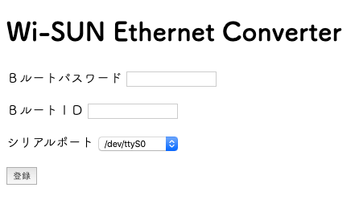
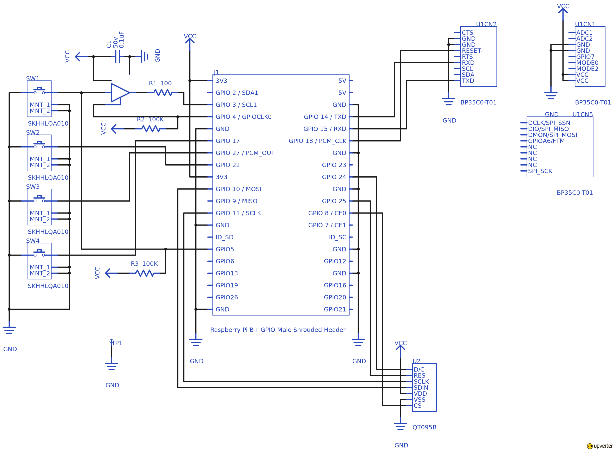

# Wi-SUN Gateway

## 概要

Ｂルート接続されたスマートメータとの Wi-SUN 通信を、 Ethernet 通信に変換するものです。

## 変更点

-   本プロダクトは、Keisuke Minami 氏の[python-echonet-lite](https://github.com/kminami/python-echonet-lite)を流用しています。
-   変更点は以下の通りです。
    -   Frame クラス
        -   get_key()メソッドの追加
    -   Node クラス
        -   socket オブジェクトをローカル変数からインスタンス変数に変更
        -   \_deliver()メソッドと service()メソッドの引数に通信相手の IP アドレスを追加
        -   sendto()メソッドの追加
        -   bind 失敗時のリトライを追加
    -   Property クラス
        -   EDT 値の取り出し位置を修正
        -   Node オブジェクトの保持と getter／setter の追加

## インストール

- Raspberry Pi OS Lite (32bit)
    - 動作確認時のバージョン -> [September 22nd 2022](https://downloads.raspberrypi.org/raspios_lite_armhf/images/raspios_lite_armhf-2022-09-26/2022-09-22-raspios-bullseye-armhf-lite.img.xz)
    - SDカードの Boot パーティションの設定
        - ssh の有効化
            - ファイル名 `ssh` で空ファイルを作成
        - WiFi 設定
            - ファイル名 `wpa_supplicant.conf` を作成
                ```
                ctrl_interface=DIR=/var/run/wpa_supplicant GROUP=netdev
                update_config=1
                country=JP

                network={
                 ssid="あなたのSSID"
                 psk="あなたのパスワード"
                }
                ```
        - pi ユーザーの作成
            - パスワードハッシュの作成
                - 手持ちの Linux シェルで以下を実行 (-6 は -5, -1, なし も可)
                    ```
                    openssl passwd -6 設定するパスワード
                    ```
            - ファイル名 `userconf` を作成
                ```
                pi:作成したパスワードハッシュ
                ```

-   環境設定 (ネットワーク越しにSSHログインできる)
    ```
    pi@raspberrypi:~ $ sudo raspi-config
    ```
    - 3 Interface Options (SPI, ハードウェアシリアルを有効にする)
        - I4 SPI
            - Would you like the SPI interface to be enabled? -> Yes
        - I6 Serial Port
            - Would you like a login shell to be accessible over serial? -> No
            - Would you like the serial port hardware to be enabled? -> Yes
    - 5 Localisation Options (タイムゾーンをTokyoにする)
        - L2 Timezone

-   ソース取得

    ```
    pi@raspberrypi:~ $ sudo apt update
    pi@raspberrypi:~ $ sudo apt upgrade
    pi@raspberrypi:~ $ sudo apt -y install git
    pi@raspberrypi:~ $ git clone -b wisun-gateway https://github.com/nao-pon/python-echonet-lite wisun-gateway
    ```

-   インストール
    -   依存ライブラリ取得
    -   関連ツールのインストール
    -   自動起動設定
    ```
    pi@raspberrypi:~ $ cd wisun-gateway
    pi@raspberrypi:~/wisun-gateway $ sh install.sh
    ```

## 設定

-   下記のいずれかの方法で設定する
    1. config.ini を直接編集
        - pwd…Ｂルートパスワード
        - bid…ＢルートＩＤ
        - serial_port…Wi-SUN モジュールが接続されているシリアルデバイス名


        ```
        [smartmeter]
        pwd = <password for B-route>
        bid = <id for B-route>
        serial_port = /dev/ttyAMA0
        ```
    1. ブラウザで「http://<IP アドレス>:9000」にアクセスして、Ｂルートパスワード・ＢルートＩＤ・シリアルデバイス名を設定する。

        

- ST7789 ディスプレイを使用時は config.ini の SSD1331 パートをコメントアウトして、ST7789 パートのコメントアウトを外す。

## 回路図



## License

Copyright 2014 Keisuke Minami
Copyright 2019 katsumin

Apache License 2.0

[echonet lite]: http://www.echonet.gr.jp/ "ECHONET Lite"
[kadecot]: http://kadecot.net/ "Kadecot"
